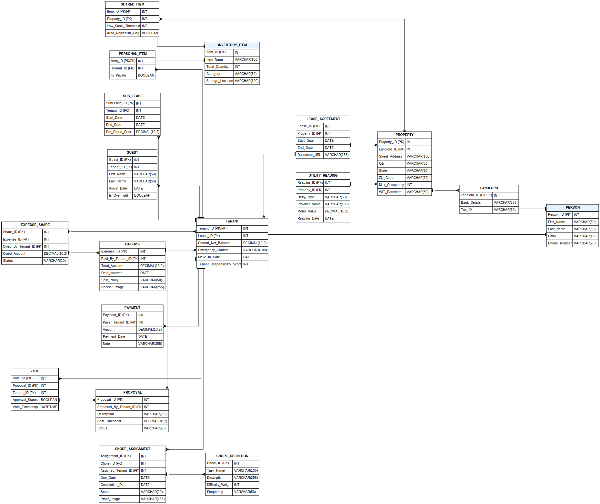

# 🏠 CoHabitant: Expense and Intelligent Shared Living Management System

📘 **Course:** DAMG 6210  
👥 **Group Number:** 6  

## 👤 Group Members
- Deep Prajapati  
- Tianyi Fan  
- Ashfaq Ahmed Mohd  

---

## 1️⃣ Logical Relational Schema (3NF)

*(The diagram below represents our fully normalized Third Normal Form logical schema, including all Primary Keys, Foreign Keys, and Data Types.)*

---

---

## 2️⃣ Summary of Changes: Conceptual (P2) ➜ Logical Model (P3)

To convert the conceptual design into a strict **3NF relational schema**, the following improvements were made:

### 🔹 Composite Attributes Removed
To satisfy **1NF**, composite attributes were broken into atomic fields:
- `Name` ➜ `First_Name`, `Last_Name` (PERSON, GUEST)
- `Address` ➜ `Street_Address`, `City`, `State`, `Zip_Code` (PROPERTY)

### 🔹 Inheritance Resolution
Relational databases do not support EER inheritance directly.  
A **Table-Per-Type** approach was used:
- Subtypes: `LANDLORD`, `TENANT`, `SHARED_ITEM`, `PERSONAL_ITEM`
- Each subtype uses the supertype PK as both **PK and FK**

### 🔹 Explicit Foreign Keys
All **1:M relationships** were implemented using Foreign Keys on the “many” side.

### 🔹 Standard Data Types
SQL-standard types assigned:  
`INT`, `VARCHAR`, `DATE`, `DATETIME`, `BOOLEAN`, `DECIMAL(10,2)`  
💰 All financial values use `DECIMAL(10,2)`.

### 🔹 Addressing Phase 2 Professor Feedback

**Q: Is the same lease agreement associated with multiple tenants? Is that your intention?** **A:** Yes, this is fully intentional. In a shared living environment, multiple roommates (Tenants) typically co-sign or are associated with a single master `LEASE_AGREEMENT`. Therefore, the relationship is structured as 1 Lease to Many Tenants.

**Q: The relationship between Utility Reading and Property is reversed.** **A:** This was corrected in Phase 3. The `PROPERTY` now acts as the parent entity (1), and `UTILITY_READING` is the child entity (M), ensuring that multiple monthly readings correctly map to a single property via the `Property_ID` foreign key.

**Q: Chore Weight Factor appears in both Tenant and Chore Definition. Is there a reason for this duplication?** **A:** This was a conceptual duplication that has been resolved in the 3NF logical model. `CHORE_DEFINITION` now exclusively holds `Difficulty_Weight` (the nature of the task), while `TENANT` holds a `Tenant_Responsibility_Score` (an individual's completion standing).

**Q: The relationship between Chore Definition and Assignment is reversed.** **A:** This has been corrected. One `CHORE_DEFINITION` (e.g., "Clean Kitchen") can generate many `CHORE_ASSIGNMENT` instances over time. The assignment table now correctly holds the `Chore_ID` foreign key.

**Q: What is the purpose of the Proposal entity? Does one Vote apply to many tenants?** **A:** The `PROPOSAL` entity establishes a democratic governance system for the household, allowing roommates to suggest major shared purchases or rules (e.g., items over $50). It creates a digital paper trail for decision-making. Regarding votes: one Vote does *not* apply to many tenants. The relationship is 1 Tenant to Many Votes, and 1 Proposal to Many Votes. Each `VOTE` record belongs to exactly one Tenant and applies to exactly one Proposal, ensuring complete accountability of who approved or rejected specific items.

---

## 3️⃣ Logical Entities, Attributes, and Data Types

---

### 👤 A. User Management

#### 1. PERSON
- `Person_ID` (INT) – **PK**
- `First_Name` (VARCHAR(50))
- `Last_Name` (VARCHAR(50))
- `Email` (VARCHAR(100))
- `Phone_Number` (VARCHAR(20))

#### 2. LANDLORD
- `Landlord_ID` (INT) – **PK, FK → PERSON**
- `Bank_Details` (VARCHAR(255))
- `Tax_ID` (VARCHAR(50))

#### 3. TENANT
- `Tenant_ID` (INT) – **PK, FK → PERSON**
- `Lease_ID` (INT) – **FK → LEASE_AGREEMENT**
- `Current_Net_Balance` (DECIMAL(10,2))
- `Emergency_Contact` (VARCHAR(100))
- `Move_In_Date` (DATE)
- `Tenant_Responsibility_Score` (INT)

---

### 🏢 B. Property & Occupancy

#### 4. PROPERTY
- `Property_ID` (INT) – **PK**
- `Landlord_ID` (INT) – **FK**
- `Street_Address` (VARCHAR(150))
- `City` (VARCHAR(50))
- `State` (VARCHAR(50))
- `Zip_Code` (VARCHAR(20))
- `Max_Occupancy` (INT)
- `WiFi_Password` (VARCHAR(50))

#### 5. LEASE_AGREEMENT
- `Lease_ID` (INT) – **PK**
- `Property_ID` (INT) – **FK**
- `Start_Date` (DATE)
- `End_Date` (DATE)
- `Document_URL` (VARCHAR(255))

#### 6. SUB_LEASE
- `SubLease_ID` (INT) – **PK**
- `Tenant_ID` (INT) – **FK**
- `Start_Date` (DATE)
- `End_Date` (DATE)
- `Pro_Rated_Cost` (DECIMAL(10,2))

#### 7. GUEST
- `Guest_ID` (INT) – **PK**
- `Tenant_ID` (INT) – **FK**
- `First_Name` (VARCHAR(50))
- `Last_Name` (VARCHAR(50))
- `Arrival_Date` (DATE)
- `Is_Overnight` (BOOLEAN)

---

### 📦 C. Inventory System

#### 8. INVENTORY_ITEM
- `Item_ID` (INT) – **PK**
- `Item_Name` (VARCHAR(100))
- `Total_Quantity` (INT)
- `Category` (VARCHAR(50))
- `Storage_Location` (VARCHAR(100))

#### 9. SHARED_ITEM
- `Item_ID` (INT) – **PK, FK**
- `Property_ID` (INT) – **FK**
- `Low_Stock_Threshold` (INT)
- `Auto_Replenish_Flag` (BOOLEAN)

#### 10. PERSONAL_ITEM
- `Item_ID` (INT) – **PK, FK**
- `Tenant_ID` (INT) – **FK**
- `Is_Private` (BOOLEAN)

---

### 💰 D. Financial Management

#### 11. EXPENSE
- `Expense_ID` (INT) – **PK**
- `Paid_By_Tenant_ID` (INT) – **FK**
- `Total_Amount` (DECIMAL(10,2))
- `Date_Incurred` (DATE)
- `Split_Policy` (VARCHAR(50))
- `Receipt_Image` (VARCHAR(255))

#### 12. EXPENSE_SHARE
- `Share_ID` (INT) – **PK**
- `Expense_ID` (INT) – **FK**
- `Owed_By_Tenant_ID` (INT) – **FK**
- `Owed_Amount` (DECIMAL(10,2))
- `Status` (VARCHAR(20))

#### 13. PAYMENT
- `Payment_ID` (INT) – **PK**
- `Payer_Tenant_ID` (INT) – **FK**
- `Amount` (DECIMAL(10,2))
- `Payment_Date` (DATE)
- `Note` (VARCHAR(255))

---

### 🧹 E. Chores & Governance

#### 14. CHORE_DEFINITION
- `Chore_ID` (INT) – **PK**
- `Task_Name` (VARCHAR(100))
- `Description` (VARCHAR(255))
- `Difficulty_Weight` (INT)
- `Frequency` (VARCHAR(50))

#### 15. CHORE_ASSIGNMENT
- `Assignment_ID` (INT) – **PK**
- `Chore_ID` (INT) – **FK**
- `Assigned_Tenant_ID` (INT) – **FK**
- `Due_Date` (DATE)
- `Completion_Date` (DATE)
- `Status` (VARCHAR(20))
- `Proof_Image` (VARCHAR(255))

#### 16. PROPOSAL
- `Proposal_ID` (INT) – **PK**
- `Proposed_By_Tenant_ID` (INT) – **FK**
- `Description` (VARCHAR(255))
- `Cost_Threshold` (DECIMAL(10,2))
- `Status` (VARCHAR(20))

#### 17. VOTE
- `Vote_ID` (INT) – **PK**
- `Proposal_ID` (INT) – **FK**
- `Tenant_ID` (INT) – **FK**
- `Approval_Status` (BOOLEAN)
- `Vote_Timestamp` (DATETIME)

---

### ⚡ F. Utility Analytics

#### 18. UTILITY_READING
- `Reading_ID` (INT) – **PK**
- `Property_ID` (INT) – **FK**
- `Utility_Type` (VARCHAR(50))
- `Provider_Name` (VARCHAR(100))
- `Meter_Value` (DECIMAL(10,2))
- `Reading_Date` (DATE)

---

## 4️⃣ Normalization Report (Achieving 3NF)

### ✅ First Normal Form (1NF)
- All attributes are atomic  
- Each table has a unique Primary Key  
- No repeating groups  

**Examples:**
- Guests stored in a separate `GUEST` table  
- Address and Name split into atomic fields  

---

### ✅ Second Normal Form (2NF)
- All tables use single-column surrogate keys  
- No composite primary keys  

➡️ Partial dependencies are eliminated.

---

### ✅ Third Normal Form (3NF)
- No transitive dependencies  

**Examples:**

🔹 **Property–Landlord Separation**  
`PROPERTY` stores only `Landlord_ID`  
Sensitive data like bank details remain in `LANDLORD`.

🔹 **Expense Normalization**  
`EXPENSE_SHARE` references `EXPENSE` via FK and stores only:
- `Owed_Amount`
- `Status`

No redundant financial data stored.

---

## 5️⃣ Clarification of Complex Multi-Role Relationships (Addressing Circular Dependency Concerns)

In optimizing the logical schema, specific multi-table relationships may visually appear circular in an ERD but are strictly necessary to enforce distinct business roles without data loss.

### 1. The Expense and Expense Share Relationship (`TENANT` ↔ `EXPENSE` ↔ `EXPENSE_SHARE`)
* While `EXPENSE_SHARE` is linked to an `EXPENSE`, and both link to `TENANT`, these relationships serve two entirely different financial roles. 
* `EXPENSE` contains `Paid_By_Tenant_ID`. This tracks the **Creditor** (the single roommate who used their credit card to pay the store).
* `EXPENSE_SHARE` contains `Owed_By_Tenant_ID`. This tracks the **Debtors** (the other roommates who owe money for that receipt).
* **Conclusion:** If the relation between `TENANT` and `EXPENSE_SHARE` is removed, the system would know an expense is being split, but would completely lose the identity of *who owes the money*. Both foreign keys are mandatory.

### 2. The Proposal and Vote Relationship (`TENANT` ↔ `PROPOSAL` ↔ `VOTE`)
* Similarly, `PROPOSAL` contains `Proposed_By_Tenant_ID` to track the **Creator** of the idea.
* `VOTE` contains `Tenant_ID` to track the **Voter**. 
* **Conclusion:** If the `Tenant_ID` is removed from the `VOTE` table, all votes become anonymous. To enforce democratic accountability, the system must record exactly which roommate cast which vote.
